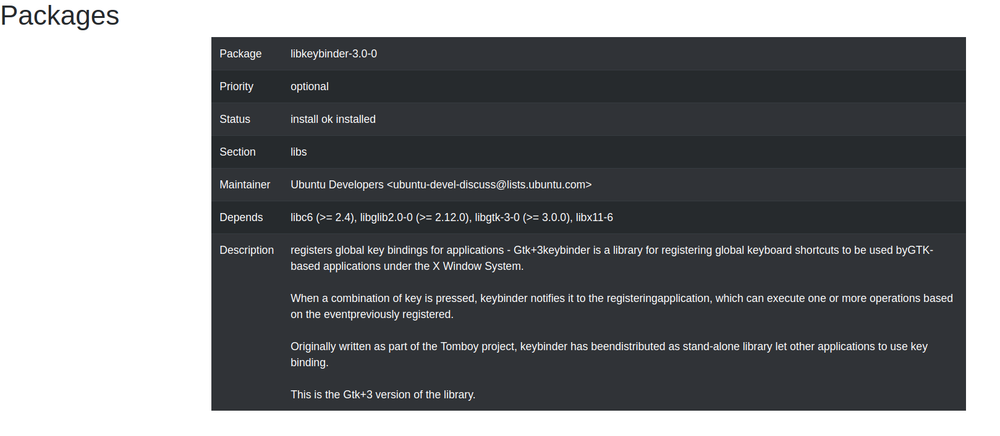

# YART-packages
Yet Another Recruitment Test - Packages

## See it live
start the local django server `python3 manage.py runserver` inside `pkgs/`
- http://127.0.0.1:8000/pkgs/json the JSON data
- http://127.0.0.1:8000/pkgs/html a basic responsive layout with Bootstrap 4

## Known issues
- The requirement for piped dependencies has not been implemented. 
    I chose to prioritize tests instead: i prefer shipping a subset of features that is tested, 
    over shipping anything which is untested.
- Hyphenated key names are invalid, this became an issue in the template
- Minor spacing glitches in the Description field
- The HTML template does not separate visual includes/components in their own little  files, 
    as this was a Nice-To-Have i didn't prioritize on cleanliness, but merely wanted 
    to demonstrate a basic conceptual grasp of the material.


### Timelog

- Hour 1: Spent the first hour setting up Django and resolving version conflicts that 
    were not an issue at all in a different directory i used for a tutorial.
- Hour 2: Decided the app should not have sudo and dumped my local version into the project instead, 
    then figured out how to read it in a way that closes the file and doesn't cause memory leaks
- Hour 3: i was always bad at regex, packages like demjson and dirtyjson also didn't work out as hoped
- Hour 4-5: Worked towards JSON valid output
- Hour 6-7: refactoring/Crash course in Python OO and templates, refresher on Bootsreap 4
- hour 8: reading up and and trying to implement unittests, emphesis on "trying"

### External PIP3 packages
- PyYaml


### JSON Sample (using status_small.txt)
```
[
  {
    "Package": "libkeybinder-3.0-0",
    "Status": "install ok installed",
    "Priority": "optional",
    "Section": "libs",
    "Installed-Size": "33",
    "Maintainer": "Ubuntu Developers <ubuntu-devel-discuss@lists.ubuntu.com>",
    "Architecture": "amd64",
    "Multi-Arch": "same",
    "Source": "keybinder-3.0",
    "Version": "0.3.2-1",
    "Depends": "libc6 (>= 2.4), libglib2.0-0 (>= 2.12.0), libgtk-3-0 (>= 3.0.0), libx11-6",
    "Description": "registers global key bindings for applications - Gtk+3keybinder is a library for registering global keyboard shortcuts to be used byGTK-based applications under the X Window System.<br><br> When a combination of key is pressed, keybinder notifies it to the registeringapplication, which can execute one or more operations based on the eventpreviously registered.<br><br> Originally written as part of the Tomboy project, keybinder has beendistributed as stand-alone library let other applications to use key binding.<br><br> This is the Gtk+3 version of the library.",
    "Original-Maintainer": "Andrew Starr-Bochicchio <asb@debian.org>",
    "Homepage": "https://github.com/engla/keybinder"
  },
  {
    "Package": "libxcb-xkb1",
    "Status": "install ok installed",
    "Priority": "optional",
    "Section": "libs",
    "Installed-Size": "153",
    "Maintainer": "Ubuntu Developers <ubuntu-devel-discuss@lists.ubuntu.com>",
    "Architecture": "amd64",
    "Multi-Arch": "same",
    "Source": "libxcb",
    "Version": "1.13-1",
    "Depends": "libc6 (>= 2.14), libxcb1",
    "Description": "X C Binding, XKEYBOARD extensionThis package contains the library files needed to run software usinglibxcb-xkb, the XKEYBOARD extension for the X C Binding.<br><br> The XCB library provides an interface to the X Window System protocol,designed to replace the Xlib interface.  XCB provides several advantages overXlib:<br><br> <li>Size: small library and lower memory footprint<li>Latency hiding: batch several requests and wait for the replies later<li>Direct protocol access: one-to-one mapping between interface and protocol<li>Thread support: access XCB from multiple threads, with no explicit locking<li>Easy creation of new extensions: automatically generates interface from   machine-parsable protocol descriptions",
    "Original-Maintainer": "Debian X Strike Force <debian-x@lists.debian.org>",
    "Homepage": "https://xcb.freedesktop.org"
  },
  {
    "Package": "libavahi-core7",
    "Status": "install ok installed",
    "Priority": "optional",
    "Section": "libs",
    "Installed-Size": "268",
    "Maintainer": "Ubuntu Developers <ubuntu-devel-discuss@lists.ubuntu.com>",
    "Architecture": "amd64",
    "Multi-Arch": "same",
    "Source": "avahi",
    "Version": "0.7-3.1ubuntu1.1",
    "Depends": "libavahi-common3 (>= 0.6.16), libc6 (>= 2.15)",
    "Description": "Avahi's embeddable mDNS/DNS-SD libraryAvahi is a fully LGPL framework for Multicast DNS Service Discovery.It allows programs to publish and discover services and hostsrunning on a local network with no specific configuration. Forexample you can plug into a network and instantly find printers toprint to, files to look at and people to talk to.<br><br> This package contains the library for Avahi's embeddable mDNS/DNS-SD stack.This can be used by embedded applications to integrate mDNS/DNS-SDfunctionality into their applications.<br><br> You should not however use this library for non-embedded applications, youshould use libavahi-client which interacts with the avahi daemon.",
    "Homepage": "http://avahi.org/",
    "Original-Maintainer": "Utopia Maintenance Team <pkg-utopia-maintainers@lists.alioth.debian.org>"
  }
]
```

### HTML screenshot
